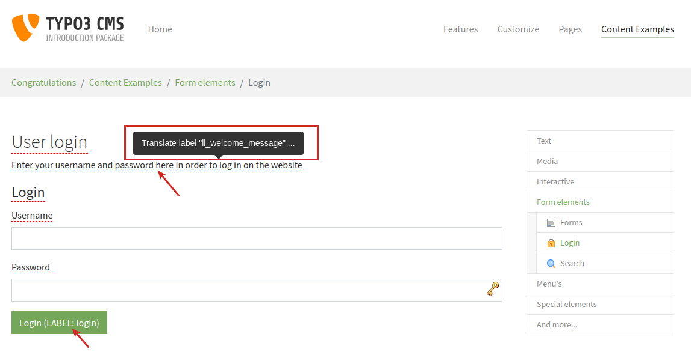
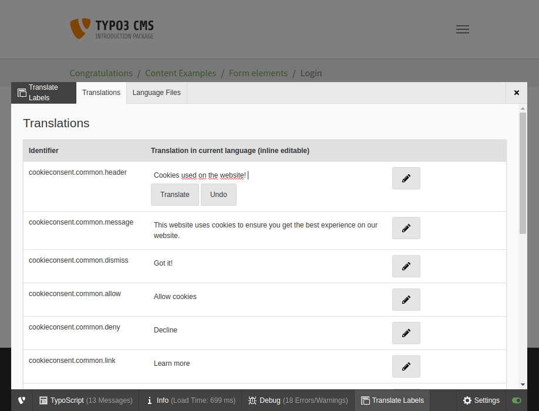
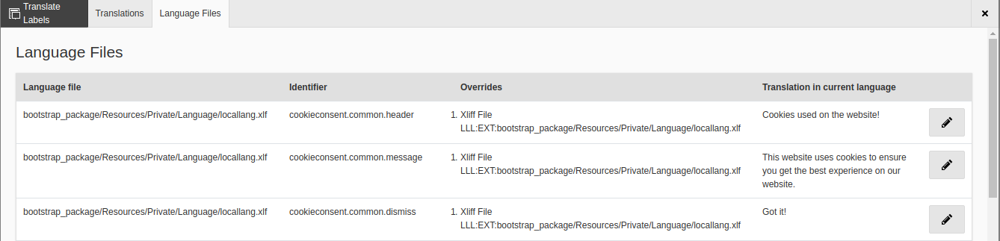

# Extension Translatelabels for TYPO3

## Purpose

This extension extends the TYPO3 translation handling by translation
records that can be edited by backend users.
In this way backend users are able to translate labels without having
access to the language files.

This extension can also be used to translate forms created with the 
Form Editor.

In the frontend the labels appear underlined with a red line.
A tooltip with its name appears on mouseover.
A click on the label name opens the new translate module in the 
admin panel to edit the translation for the label inline.

Additionally you find a second tab in the new module in the admin panel 
that shows all labels found on the current page listing the corresponding
language files and eventually existing overrides or translation
records. 

This view is especially interesting for developers.

## Authors & Sponsors

* Alexander Bohndorf - <bohndorf@sitegeist.de>

The development and the public-releases of this package is generously sponsored by my employer https://www.sitegeist.de.

## Screenshots

### Frontend view



### Translation module in admin panel with inline editing



### Translation module in admin panel with label inheritance view



## Supported TYPO3 Versions

* Version 1.x of this extension supports TYPO3 9.5.
* Version 2.x of this extension supports TYPO3 10.1 and 11.5.

## How to install

- Install the extension and activate it in Extension Manager or via
composer:

  - For TYPO3 9.5:
    ```
    composer require sitegeist/translatelabels:^1
    ```
  - For TYPO3 10.0 and 10.1:
    ```
    composer require sitegeist/translatelabels
    ```
- Then go to the backend extension manager and load the extension
in "Installed Extensions".
- Update your database with BE module "Maintenance/Analyze Database Structure".
- Create a sysfolder in TYPO3 backend to store the translated
labels.
- Create a localization of this sysfolder for each website language of
your website.
- Include the extension template `translate_labels` into your
root TYPOSCRIPT template.

## How to configure

Add the following TYPOSCRIPT to your template:

```
plugin.tx_translatelabels.settings.storagePid = 4711
```

Replace `4711` with the uid of the sysfolder you just created for
your translated labels.

Be aware that this setting has to be defined for all pages using
this extension and also for all sysfolders containing the translation
records.

## TYPO3 patch needed (bug #87038) 

Due to the not yet fixed bug https://forge.typo3.org/issues/87038 in 
TYPO3 9.5.9 and TYPO3 10.1 you have to apply a patch to your TYPO3 sources at present.

Use the latest patch set for your TYPO3 version attached to the issue.

Alternatively you can use a patch included in this extension for convenience.

[Quick guide to apply the patch](Documentation/Typo3Patch.md)

[Instructions for applying a patch to the TYPO3 sources (german)](https://techblog.sitegeist.de/typo3-version-9-core-patches-mit-composer-verwalten/)

Without this patch TYPO3 is not able to create translations of
label records having the same key as their related record in the
default language.

## Change Log

| translatelabels | TYPO3  | Changes                                 |
|-----------------|--------|-----------------------------------------|
| 1.0.x           | 9.5.x  | Initial release                         |
| 1.1.x           | 9.5.x  | Removed LLL:EXT: prefix from label keys |
| 2.0.x           | 10.1.x | Compatibility for TYPO3 10.1            |
| 2.1.x           | 11.5.x | Compatibility for TYPO3 11.5            |

## How to activate for BE users

1. [Enable admin panel for BE users.](https://docs.typo3.org/m/typo3/reference-tsconfig/9.5/en-us/UserTsconfig/AdmPanel.html)
  1.1 Set `admPanel.enable.all = 1` in User TSconfig or `admPanel.enable.translatelabels = 1`
  1.2 Set `config.admPanel = 1` in TypoScript Template
2. Login into BE and open FE afterwards.
3. Click on Settings in the bottom right of admin panel.
4. Activate "Show translation labels" in settings and click on "Update
settings".
5. After that you will see all labels in FE underlined with a red dashed
line having a tool tip with the link to the language file and its
key.
6. Furthermore you will see a list of all used labels of the current page
in Admin Panel in tab "Translate Labels".

## Access rights to translate labels

Backend users who are allowed to create and edit translations need to
have ...

- access rights to read and write records in the sysfolder for the 
translations (set them in BE module `Access`)
- BE user or group rights to list and modify records of table 
`Translation` (set them in BE module `Backend-User`)
- access to default language and to all languages
in which they are to translate labels. (set them in BE module `Backend-User`)

## Internals

The extension overloads the f:translate fluid view helper and
renders a tag ```LLL:("<translation>","<key>")``` for each label (only,
if you are logged in as BE user, otherwise the labels are rendered
as usual). 

After all processing of frontend rendering the LLL: tags are transformed
into HTML markup to display a dashed red line below each label with a
tooltip showing the language file and the labels key. This also occurs
only while being logged in as BE user.

## Form Framework

This extension can be used to translate forms created with form editor
including validation messages, labels, placeholders, descriptions etc.
Therefore this extension overrides the following two view helpers of 
form framework:

- formvh:translateElementProperty
- formvh:translateElementError

Form framework uses special chaining of translations for elements.
For further information have a look at:
https://docs.typo3.org/c/typo3/cms-form/9.5/en-us/Concepts/FrontendRendering/Index.html#translation

This extension implements a simplified approach to override these translations:
You can only override the most specific translation of an element using
the path `<formDefinitionIdentifier>.element.<elementIdentifier>.properties.<propertyName>`.

Examples:
- Translation of a label of a form field
  - `registerForm.element.first-name.properties.label`
- Translation of a description of a form field
  - `registerForm.element.first-name.properties.description`
- Translation of an option with value `value1` of a radio button
  - `registerForm.element.radiobutton-1.properties.options.value1`
- Translation of an option for a multi select checkbox with value `Second`
  - `register.element.multicheckbox-1.properties.options.Second`
- Translation of the placeholder attribute  
  - `registerForm.element.text-1.properties.fluidAdditionalAttributes.placeholder`
  
If a translation is defined for an element in the database then this
will always take precedence over others defined in language files
regardless of priority in the chain defined by form framework.

This behaviour is subject of change in the future.

### Validation messages in Form Framework

If custom error messages are defined in form editor then only these
messages are used for all languages and no translation chain takes place.
This is default behaviour in form framework.

With this extension you can override these static values.

Example:

- `registerForm.validation.error.text-2.1428504122`

## Caching

The extension is completely compatible with TYPO3 caching mechanisms.

Caching is disabled if translation labels are activated in admin panel.
This is because otherwise the markup showing the translation labels
would be cached and delivered as content also for frontend users not
being also logged in as backend users.

## Old pi_base plugins

Due to API restrictions it is not possible to extend the old language
handling of plugins based on AbstractPlugin (a.k.a. pi_base plugins).
Instead each inherited class has to be extended directly via xclass.
This extension has an example for this for the plugin fe_login in
```Classes/Plugin/FrontendLoginController.php```.

You can overload other pi_base plugins using the following code in
your ext_localconf.php:

```php

$GLOBALS['TYPO3_CONF_VARS']['SYS']['Objects']['TYPO3\\CMS\\Felogin\\Controller\\FrontendLoginController'] = array(
    'className' => 'Sitegeist\\Translatelabels\\Plugin\\FrontendLoginController'
);
```

## Example for overriding language files

ext_localconf.php

```php
// Examples for overriding language files

$overrideLanguageFiles = [
    'default' => [
        'EXT:felogin/Resources/Private/Language/locallang.xlf' => 'felogin/felogin.xlf'
    ],
    'de' => [
        'EXT:felogin/Resources/Private/Language/locallang.xlf' => 'felogin/de.felogin.xlf'
    ]
];

foreach ($overrideLanguageFiles as $language => $languageFiles) {
    foreach ($languageFiles as $originalLanguageFile => $overrideLanguageFile) {
        $GLOBALS['TYPO3_CONF_VARS']['SYS']['locallangXMLOverride'][$language][$originalLanguageFile][] =
            'EXT:my_extension/Resources/Private/Language/Overrides/' . $overrideLanguageFile;
    }
}

```

Note that `my_extension` should be replaced with your extension key.

## Run unit tests

```
$ cd typo3conf/ext/translatelabels
$ composer install
$ vendor/bin/phpunit -c vendor/typo3/testing-framework/Resources/Core/Build/UnitTests.xml Tests/Unit/Renderer/FrontendRendererTest.php
```
